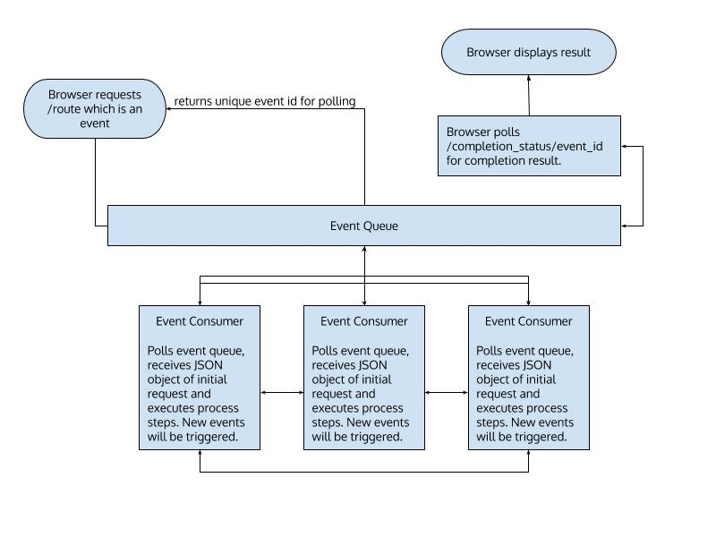
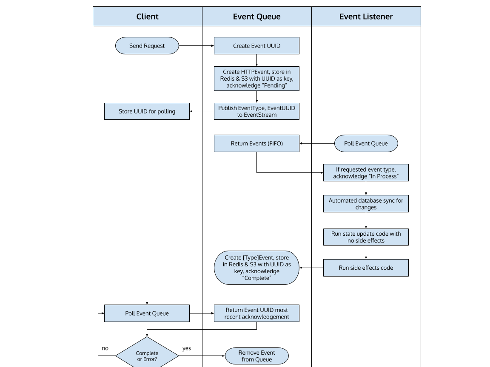

<!-- PROJECT LOGO -->
<br />
<p align="center">
<a href="/">
  
</a>
  <h3 align="center">Clockwork Event Source Framework</h3>

  <p align="center">
    A minimalist NodeJS (TypeScript) + Redis Event Sourcing Framework
    <br />
    <a href="https://github.com/canadiannomad/clockwork-event-sourcing/issues">Report Bug</a>
    ·
    <a href="https://github.com/canadiannomad/clockwork-event-sourcing/issues">Request Feature</a>
  </p>
</p>

<!-- TABLE OF CONTENTS -->
<details open="open">
	<summary>Table of Contents</summary>
	<ul style="list-style-type:none;">
		<li>
			<a href="#architecture-and-design">Architecture & Design</a>
			<ul style="list-style-type:none">
				<li><a href="#request-and-response">Request & Response</a></li>
				<li><a href="#event-types">Event Types</a></li>
				<li><a href="#event-statuses">Event Statuses</a></li>
				<li><a href="#terminology">Terminology</a></li>
			</ul>
		</li>
		<li>
			<a href="#setup">Setup</a>
			<ul style="list-style-type:none">
				<li><a href="#event-queue">Event Queue</a></li>
				<li><a href="#event-listener">Event Listener</a></li>
				<li><a href="#hello-world">Hello, World!</a></li>
			</ul>
		</li>
		<li><a href="#contributing">Contributing</a></li>
		<li><a href="../CODE_OF_CONDUCT.md">Code of Conduct</a></li>
		<li><a href="../LICENSE.md">License</a></li>
	</ul>
</details>

## Architecture & Design



If you are completely unfamiliar with event-driven architectures, start by reading the [Wikipedia article](https://en.wikipedia.org/wiki/Event-driven_architecture).

### Request & Response




The above diagram gives a high level overview of a single request and response polling. In production, the event queue will managing hundreds of events simultaneously, especially as initial events will trigger secondary events.

#### Request
A request is a JSON object comprising the raw server request envelope including webserver headers as well as a sanitized envelope of the request body.

The event queue assigns a [UUID](https://en.wikipedia.org/wiki/Universally_unique_identifier) for every request and returns this UUID immediately to the client so that the client can poll for the event completion. This UUID is used in every phase of the request and response to ensure threaded responses. UUIDs are unique across all event queues and types.  Once the request has been put in queue as a pending event, the event is stored in [Redis](https://en.wikipedia.org/wiki/Redis) for immediate processing as well as S3 for event backup and replay. At this point, the event queue waits for a listener to request the event and then waits for the acknowledgement of the event completion from the listener.

The event listener then accepts the request with its JSON envelope and processes the event accordingly. The event listener may, and likely will, trigger cascade events. For example, if you trigger an event to update a user's password, you will probably want to send the user an email letting them know it was changed as part of your security policy. The event for ```update_password``` would then trigger the event for ```send_email``` which would have its own separate event flow and event listener.

When the event listener has processed the event and its cascade events, it reports completion to the event queue with a response envelope.

#### Response
A response is a JSON object with the status of the event and any output or error messages.

A response has an acknowledgement and a response envelope with appropriate messages. In other words, an acknowledgement is merely the position of the event in the event workflow _which is separate from the event's success_. An event has an acknowledgement of its position as well as its success status, either success or fail.

### Event Types
Event types are part of the event envelope and are carried with the event UUID for event context. You must create at least one event listener for every event type. A type can be any valid string.  Event types must be unique.

### Event Statuses
1. **Pending** - When an event is first sent to the queue, it has a status of Pending until the listener has received the event for processing.
2. **In Process** - When the event listener receives the event, the event queue acknowledges that the event is in process.
3. **Complete** - When the event listener has terminated and informed the queue of the event disposition, the event queue acknowledges the event is complete and creates the response envelope with any error or success messages from the listener.

### Terminology
1. **Client** - any programmatic client such as a web browser or API endpoint.
2. **Event Queue** - [A FIFO queue](https://en.wikipedia.org/wiki/FIFO_(computing_and_electronics) of events with payloads and acknowledgements (statuses). The event queue is a type of data lake that is queried asynchronously by a client.
3. **Event Listener** - A block of code that polls the event queue for events with the desired type and executes the appropriate actions for the event, including firing other events.
4. **Event Type** - Custom-made event triggers that a listener would use as a key to poll the event queue for associated events.
5. **Acknowledgement** - Essentially, an event status of its position in the  call flow. Because the event queue is the event reporter, it must acknowledge the event's position in the call flow in order to respond to the client poll for event completion.

## Setup

### Event Queue

### Event Listener

Each event listener consists of a set of functions that listen for and handle certain types of events. Each listener is responsible for its own state storage.

For example, when an “HTTP Ping” listener gets triggered by the “HTTP” Event the filterEvents function should return true if the URL path is “/ping/{value}” and false otherwise. The handleStateUpdate may log the request in the data sore, then the handleSideEffects sets the HTTP response to “{value}”.

When a listener completes, it will emit a new Event that will get stored, and may trigger other listeners.

#### Minimum Listener

Event listeners should have these functions for minimum interaction with the queue.

* bool filterEvents(Event)
* void handleStateUpdate(Event)
* Event handleSideEffects(Event)


### Hello, World!

A sample application has been provided in . After installing ```clockwork-event-sourcing```, then follow these steps.

```sh
> cd example/events/helloworld
> npm build
> node index.js
```

## Contributing

Never made an open source contribution before? Wondering how contributions work in the in our project? Here's a quick rundown!

1. Find an issue that you are interested in addressing or a feature that you would like to add.
2. Fork the repository associated with the issue to your local GitHub organization. This means that you will have a copy of the repository under your-GitHub-username/repository-name.
3. Clone the repository to your local machine using `git clone https://github.com/canadiannomad/clockwork-event-sourcing.git`.
4. Create a new branch for your fix using git checkout -b branch-name-here.
5. Make the appropriate changes for the issue you are trying to address or the feature that you want to add.
6. Use `git add insert-paths-of-changed-files-here` to add the file contents of the changed files to the "snapshot" git uses to manage the state of the project, also known as the index.
7. Use `git commit -m "Insert a short message of the changes made here"` to store the contents of the index with a descriptive message.
8. Push the changes to the remote repository using `git push origin branch-name-here`.
9. Submit a pull request to the upstream repository.
10. Title the pull request with a short description of the changes made and the issue or bug number associated with your change. For example, you can title an issue such as "Added more log output to resolve #4352".
11. In the description of the pull request, explain the changes that you made, any issues you think exist with the pull request you made, and any questions you have for the  maintainer. It's OK if your pull request is not perfect (no pull request is), the reviewer will be able to help you fix any problems and improve it!
12. Wait for the pull request to be reviewed by a maintainer.
13. Make changes to the pull request if the reviewing maintainer recommends them.
14. Celebrate your success after your pull request is merged!
